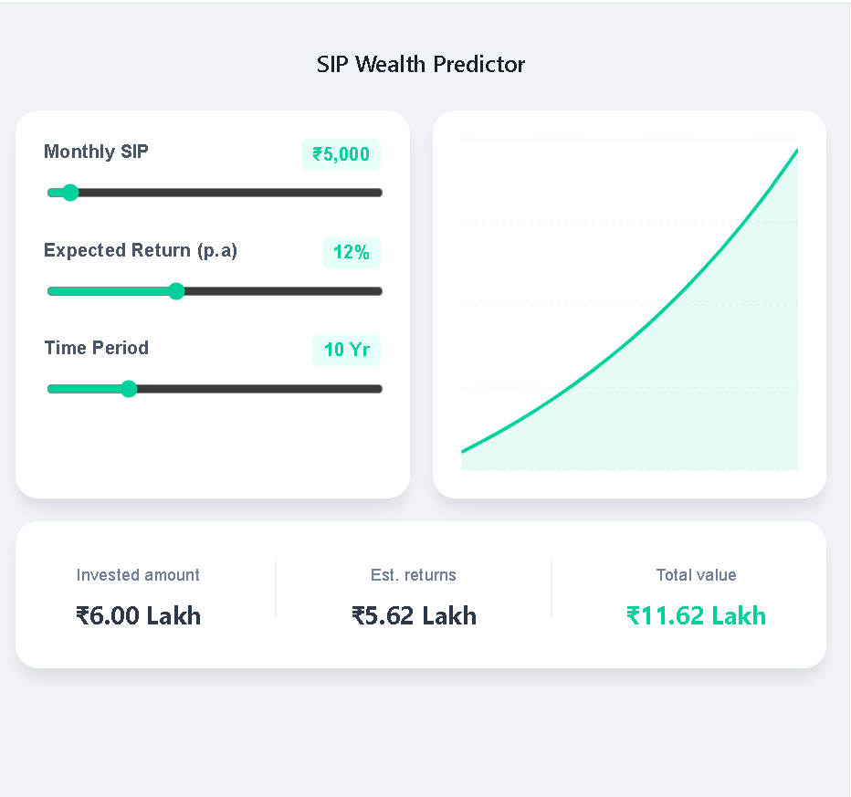

# 📈 SIP Wealth Predictor

A high-performance, interactive financial tool built with **React** and **Recharts** to help users visualize the power of compounding through Systematic Investment Plans (SIP).

## 🚀 Live Demo
**[View Live Project](https://priyanshu-sip-tracker.netlify.app)**
## ✨ Key Features
* **Interactive Visualizations:** Dynamic Area Charts powered by Recharts to show wealth growth over time.
* **Real-time Calculations:** Instant feedback on Estimated Returns and Total Wealth based on Monthly Investment, Expected Return Rate, and Time Period.
* **Responsive Design:** Fully optimized for mobile and desktop viewing.
* **Data Accuracy:** Implements standard compounding interest formulas for financial precision.

## 🛠️ Tech Stack
* **Frontend:** React.js (Vite)
* **Charts:** Recharts
* **Styling:** CSS3 (Modern Flexbox/Grid)
* **Deployment:** Netlify

## 📸 Preview
![Project Screenshot]

## 📂 Project Structure
```text
my-app/
├── src/
│   ├── components/  # Reusable UI components
│   ├── App.jsx      # Main application logic
│   └── main.jsx     # Entry point
├── public/          # Static assets
└── package.json     # Project dependencies
